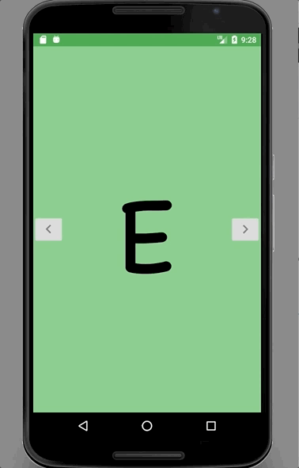

# Alphabetical App

This is my first independently created Android App. It is a children's app that is supposed to go through the English alphabet in an entertaining way. 

## Implementing Soon
* Break the SnackBar - Use [kiosk mode](http://www.andreas-schrade.de/2015/02/16/android-tutorial-how-to-create-a-kiosk-mode-in-android/).

## Future Areas of expansion 
* Add animation transitions.
* Add visually appealing things to AlphabetFinishActivity.
