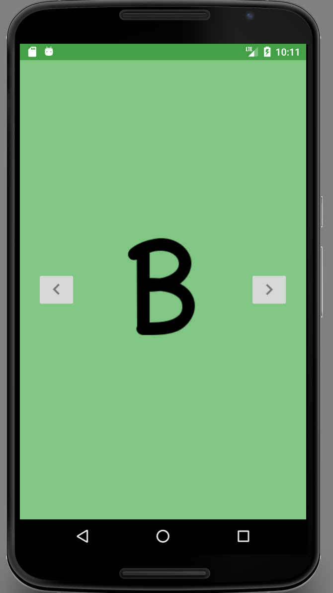

# Alphabetical App

This is my first independently created Android App. It is a children's app that is supposed to go through the English alphabet in an entertaining way. 

## Implementing Soon
* ViewPager - This will let kids swipe through the alphabet.
* Break the SnackBar - Jail children in this app so they cannot mess around with other apps.
* Include other resolutions for the alphabet images so it will look nice on tablets and phones.
* Add an activity to signal completion and offer the option to go back to the
beginning.

## Future Areas of expansion 
* Add sound to each letter.
* Add animation transitions.

